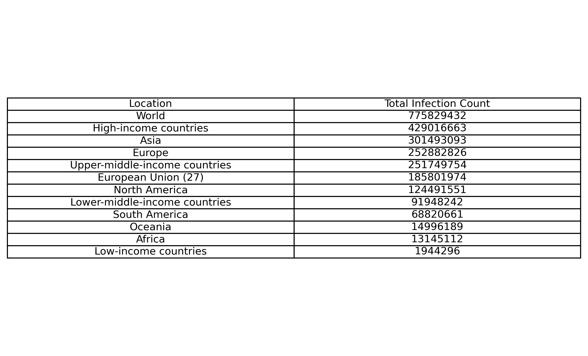
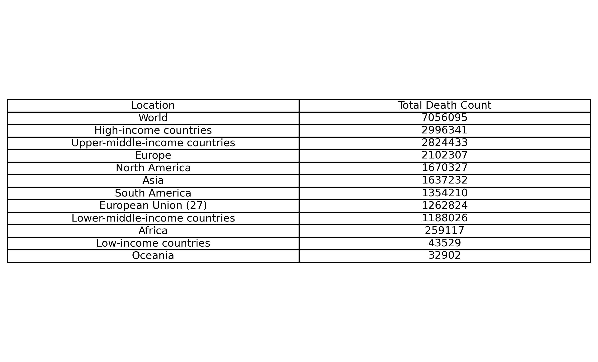
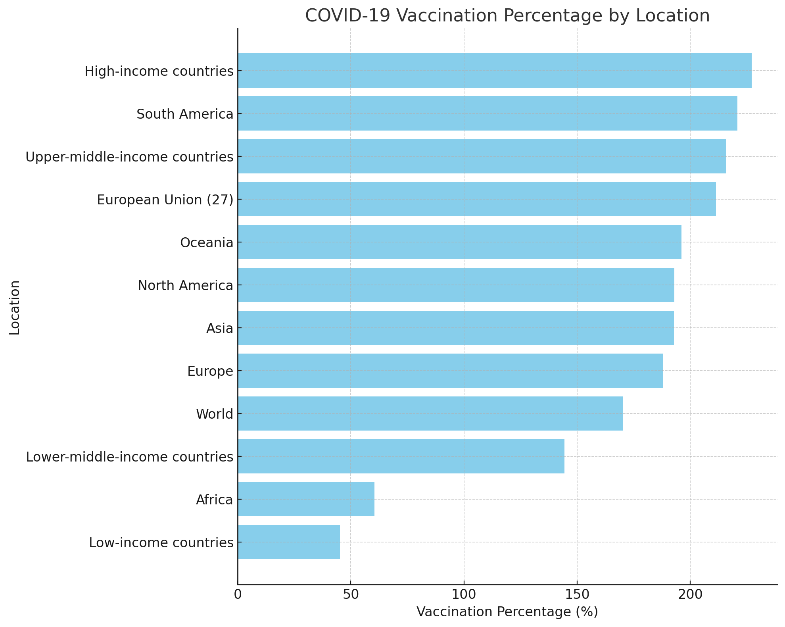

# Introduction

With this project, I aim to explore the global impact of COVID-19 through data analysis. By examining COVID-19 death rates, vaccination coverage, and the association between COVID-19 and pre-existing medical conditions, the project provides a comprehensive overview of these figures for various countries and continents (a project idea by [AlexTheAnalyst](https://github.com/AlexTheAnalyst) )

# Dataset

Covid-19 data from 1 Jan 2020 to 28 Jul 2024 from [Our World in Data](https://ourworldindata.org/covid-deaths). I utilized Excel to structure and prepare my data by creating two distinct tables each tailored to hold useful information.

# My Tools for the Project

- **Excell :** The flexible spreadsheet solution that adapts to your needs, whether for business intelligence or personal productivity.
- **PostgreSQL :** The powerhouse database that combines reliability with cutting-edge features.
- **VS Code :** Your ultimate code editor for seamless coding and debugging adventures.
- **SQL :** The language that brings your data to life with precision and power.
- **Git :** The version control wizard that keeps your code history tidy and collaborative.
- **GitHub :** Essential for sharing my SQL scripts and analysis, ensuring collaboration and project tracking.

# Exploring data

## 1. Calculate infection percentage
Let's find the infection percentage for every country on all dates

```sql
select
    location,
    date,
    total_cases,
    population,
    (total_cases/population)*100 AS infection_percentage
from covid_deaths
ORDER BY
    location,
    date
```

What about a specific country ? (in the following example i use my country Greece)

```sql
select
    location,
    date,
    total_cases,
    population,
    (total_cases/population)*100 AS infection_percentage
from covid_deaths
WHERE
    location = 'Greece'
ORDER BY
    location,
    date
```

And for for every continent

```sql
select
    location,
    date,
    total_cases,
    population,
    (total_cases/population)*100 AS infection_percentage
from covid_deaths
WHERE
    continent is NULL
ORDER BY
    location,
    date
```

## 2. Calculate death percentage
What is the percentage of the population that died from COVID-19 after being infected, for each country on all dates;

```sql
SELECT
    location,
    date,
    total_deaths,
    total_cases,
    population,
    (total_deaths/ NULLIF(total_cases, 0))*100 AS death_percentage
FROM 
    covid_deaths
ORDER BY
    location,
    date
```
A calculation for a specific country (again in this example i use my country Greece)

```sql
SELECT
    location,
    date,
    total_deaths,
    total_cases,
    population,
    (total_deaths/ NULLIF(total_cases, 0))*100 AS death_percentage
FROM
    covid_deaths
WHERE
    location = 'Greece'
ORDER BY
    location,
    date
```

And for for every continent

```sql
SELECT
    location,
    date,
    total_deaths,
    total_cases,
    population,
    (total_deaths/ NULLIF(total_cases, 0))*100 AS death_percentage
FROM
    covid_deaths
WHERE
    continent is NULL
ORDER BY
    location,
    date
```
## 3. Total infection percentage
Let's find every country's total infection percentage

```sql
SELECT
    location,
    population,
    MAX(total_cases) as total_infected_count,
    (MAX(total_cases) / population) * 100 AS total_infection_percentage
FROM
    covid_deaths 
GROUP BY
    location,
    population
HAVING
   (MAX(total_cases)/population)*100 is not NULL
ORDER BY
    total_infection_percentage DESC
```

## 4. Total death percentage
Let's find every country's total death percentage for infected population

```sql
SELECT
    location,
    population,
    MAX(total_cases) as total_infected_count,
    MAX(total_deaths) as total_death_count,
    (MAX(total_deaths)/ NULLIF (MAX(total_cases), 0))*100 AS total_death_percentage
FROM
    covid_deaths 
GROUP BY
    location,
    population
HAVING
    (MAX(total_deaths)/ NULLIF (MAX(total_cases), 0))*100 is not NULL
ORDER BY
    total_death_percentage DESC
```

## 5. Global numbers
**In the following queries i group the results by continents.**

**A.** Total number of COVID-19 infected population for each continent plus some economic comparisons 

```sql
SELECT
    location,
    MAX(total_cases) as total_infection_count
FROM
    covid_deaths
WHERE
    continent is NULL
GROUP BY
    location
ORDER BY
    MAX(total_cases) DESC
```
The results


*Table of the Total Infection Count for each continent plus some economic comparisons. This table visualization was created with Python after importing my SQL query results*

Here is the breakdown:

High-Income Countries and Asia have the highest infection counts.
Europe and Upper-Middle-Income Countries follow closely.
Low-Income Countries and Africa have the lowest counts, which might be due to less extensive testing and different population dynamics.
Oceania shows relatively low infection counts, likely due to its geographical isolation and smaller population. 

- **Reporting and Data Discrepancies:**
Variations in reported infection counts could be influenced by differences in healthcare infrastructure, testing availability, and reporting practices.

- **Impact of Economic Status:**
The higher infection counts in high-income and upper-middle-income countries might reflect their extensive testing and reporting capabilities rather than just the number of infections.
Conversely, lower counts in low-income countries could be due to less access to testing and healthcare services.

- **Geographical Impact:**
 Regions with high population densities and extensive international travel, such as Europe and Asia, naturally report higher infection numbers.

These insights can help in understanding the global spread of COVID-19 and the varying impacts across different regions and income levels.

**B.** Total number of population that died from COVID-19 after being infected for each continent plus some economic comparisons.

```sql
SELECT
    location,
    MAX(total_deaths) as total_death_count
FROM
    covid_deaths
WHERE
    continent is NULL
GROUP BY
    location
ORDER BY
    MAX(total_deaths) DESC 
```
The results


*Table of the Total Death Count for each continent plus some economic comparisons. This table visualization was created with Python after importing my SQL query results*

Here is the breakdown:
Impact of Income Levels:
Higher-income countries have higher death counts, possibly due to better reporting and higher population ages. Conversely, lower-income regions show lower death counts, potentially due to underreporting or differences in population age demographics.
Regional Response and Impact:
Europe and North America, with their extensive international travel and aging populations, experienced severe impacts early in the pandemic. Asia and South America also faced significant challenges, though the nature and timing of outbreaks varied across these regions.
Underreporting and Healthcare Disparities:
The differences between continents and income groups highlight potential disparities in healthcare access, response strategies, and the accuracy of reported data, with lower-income and less developed regions potentially underreporting due to limited resources.
This data provides a clear picture of how different regions and income groups were affected by the pandemic in terms of total deaths, offering valuable context for public health analysis and future preparedness efforts.  

 **C.** -- This SQL query calculates the total percentage of global population that died after was infected by COVID-19.


 ```sql
    SELECT
    MAX(total_cases) as total_infected_count,
    MAX(total_deaths) as total_death_count,
    (MAX(total_deaths)/ NULLIF (MAX(total_cases), 0))*100 AS total_death_percentage
FROM
    covid_deaths
WHERE
    continent is  NULL
HAVING
    (MAX(total_deaths)/ NULLIF (MAX(total_cases), 0))*100 is not NULL
```
The results


| Total Infected Count | Total Death Count | Total Death Percentage |
|----------------------|-------------------|------------------------|
| 775829432            | 7056095           |  0.909490              |

## 6. Tracking Global Vaccination Progress
I found it very enlightening το calculate the percentage of the population that has received at least one COVID-19 vaccine dose. By joining the two tables this query determines this by dividing the total number of vaccinations by the population for each location and date where data is available. 

```sql
SELECT
    covid_deaths.continent,
    covid_deaths.location,
    covid_deaths.date,
    covid_vaccinations.total_vaccinations,
    covid_deaths.population,
    (covid_vaccinations.total_vaccinations/covid_deaths.population)*100 AS vaccinated_percentage
FROM
    covid_deaths
    JOIN covid_vaccinations
        ON covid_deaths.location=covid_vaccinations.location
        AND covid_deaths.date=covid_vaccinations.date
WHERE 
    covid_deaths.continent IS NOT NULL
ORDER BY
    covid_deaths.location,covid_deaths.date  
```
For extra insights, i wrote a query to group the results by continents to observe regional trends.

```sql
SELECT
    covid_vaccinations.location,
    MAX(covid_vaccinations.total_vaccinations),
    MAX(covid_deaths.population),
    (MAX(covid_vaccinations.total_vaccinations)/MAX(covid_deaths.population))*100 AS total_vaccinated_percentage
FROM
    covid_deaths
    JOIN covid_vaccinations
        ON covid_deaths.location=covid_vaccinations.location
        AND covid_deaths.date=covid_vaccinations.date
WHERE 
    covid_deaths.continent IS NULL
GROUP BY
    covid_vaccinations.location
ORDER BY
    (MAX(covid_vaccinations.total_vaccinations)/MAX(covid_deaths.population))*100
```
The results
